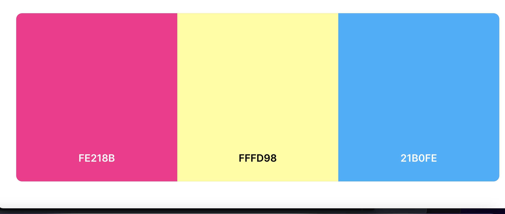

#### Site-Goals

The website aims to help users organise their events or TO-DO items.
The website is relatively simple to use, and users can get from a part to another very easily and intuitivly.  

The site aims to provide customers with a simple and easy way to organise their future events, add items, edit and delete their own items

### Agile Planning

This project was developed using agile methodologies by delivering small features in incremental sprints. 
The users’ stories are considered software features and most of them  have been implemented in order to match the criteria.  
All projects were assigned to ToDo, prioritized under the labels, must have, should have, could have. They were assigned to sprints and story pointed according to complexity. "Must have" stories were completed first, "would haves" and then finally "would like". It was done this way to ensure that all core requirements were completed first to give the project a finished look and feel.

The Kanban board was created using github projects and can be located [here](https://github.com/users/adam-blakeney/projects/1). The issues list is also available [here](https://github.com/adam-blakeney/to-do/issues).

### Kanban image

Milestones
The project had 5 main Milestones:

- Milestone 1 - Base Setup

The base setup Milestone is for all stories needed for the base set up of the application. Without the base setup, the app would not be possible.

- Milestone 2 - Standalone Pages

The standalone pages Milestone is for small pages that did not have enough stories to warrant their own full milstones. 

- Milestone 3 - Profile 

The Profile Milestone is for all stories related to the registration and login.

User with an account can view add and edit tasks.

- Milestone 4 - Deployment 

This Milestone is for all stories related to deploying the app to heroku so that the site is live for users.

- Milestone 5 - Documentation

This Milestone is for all document related stories and tasks that are needed to document the software development lifecycle of the application. It aims to deliver quality documentation, explaining all stages of development and necessary information on running, deploying and using the application.

User Stories
The following user stories were completed:

- Milestone 1 - Base Setup

As a developer, I need to create the base.html page and structure so that other pages can reuse the layout.

As a developer, I need to create static resources so that images, CSS and JavaScript work on the website.

As a developer, I need to set up the project so that it is ready for implementing the core features.

As a developer, I need to create the site template so that users can navigate the website from any device.

- Milestone 2 - Standalone Pages

As a developer, I need to implement a 404-error page to alert users when they have accessed a page that doesn't exist

As a developer, I would like a home page so that customers can view all tasks they have created.

- Milestone 3 - Profile

As a developer, I need to implement allauth so that users can sign up and have access to the website’s features.

As a site owner, I would like the allauth pages customized to that they fit in with the sites styling

- Milestone 4 - Deployment 

As a developer, I need to set up white noise so that my static files are served in deployment

As a developer, I need to deploy the project to heroku so that it is live for customers

- Milestone 5 - Documentation

Also, after this has been completed, I have decided to add a profile section where users can add, or edit their profile, and alow them and other users to preview their profile. 

On the blog page I as a developer, implemented an edit and delete button, so users can edit or delete their own posts.

Tasks:

Complete readme documentation.
Complete testing documentation write up.

# Testing 
- Test 1

Ensure a user can Sign in/out.

Steps:

If the users are logged into its account and they prefer to sign out, the user can select 'Logout' on the navbar.
After clicking 'Logout', the users will be redirected to a page where they will be returned to login screen.
Expected:

User is logged out and back to the home page.

Actual:

User is logged out and back to the home page.

- Test 2
Ensure a user can sign up to the website.

Steps:

Navigate to Finesse home page, and click on 'Register'.
Enter , username and password.
Click Sign Up.
Expected:

After filing up the required fields, and clicking on the 'Register' button, if the information is valid they will be brought to the home page logged into the account.
Actual:

After filing up the required fields, and clicking on the 'Register' button, if the information is valid they will be brought to the home page logged into the account.

# Errors during deployment.

During deployment I have encounter some errors. Firstly the static files wasan't loading. Secondly the debug buton has been changed from os.environ('DEVELOPMENT') to True, to be able to see where the errors are coming from. After that, the debug button has been changed back into False, trying to check again if the deployment works, and after came back to os.environ('DEVELOPMENT').

# Database-Design

The database was designed to allow CRUD functionality to be available to registered users when signed in. The user model is at the heart of the application as it is connected the blog side and linked by primary/foreign key relationships many to many.

# Design
I used a very bright vibrant color palette for this project. It is a highlighter style. I chose this as i used very slim lines in my project so this is to add depth to it and make it easier to see areas of importance to the user.

i also liked the very minimalistic design as it is a daily app i dont want it cluttered or too much to work with it keeps it easy and fresh.

# Security

Environment variables were stored in an env.py for local development and for security purposes to ensure no secret keys, api keys or sensitive information was added the repository. In production, these variables were added to the heroku config vars within the project.

